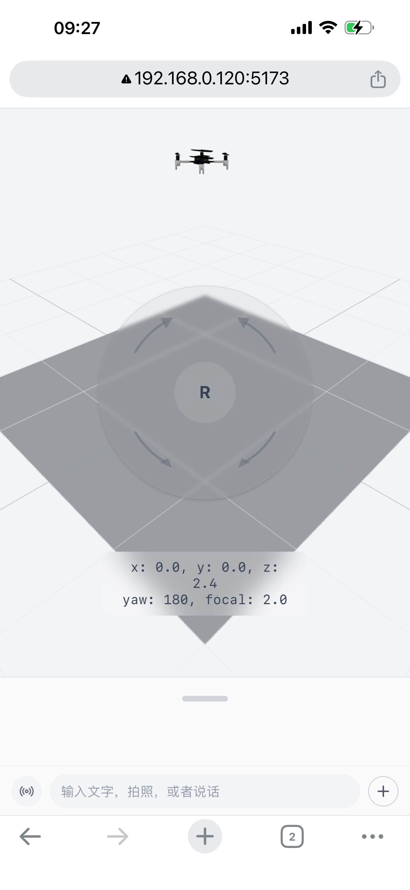
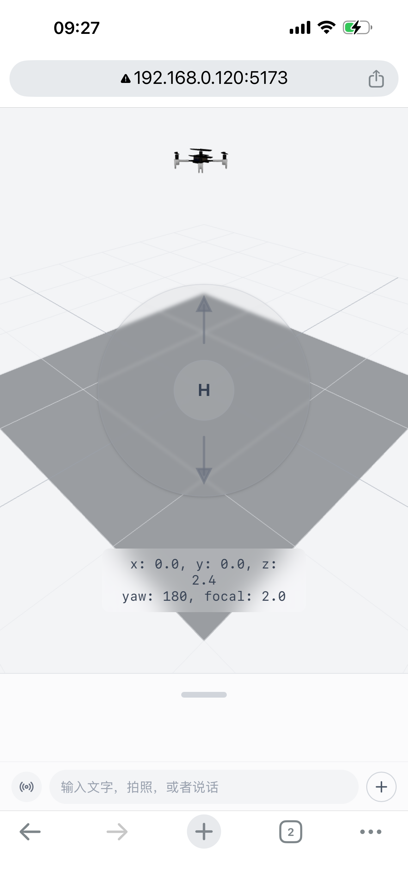
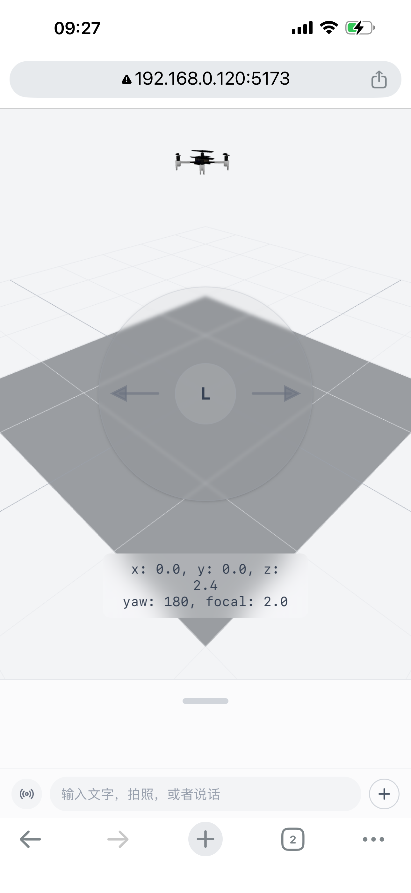
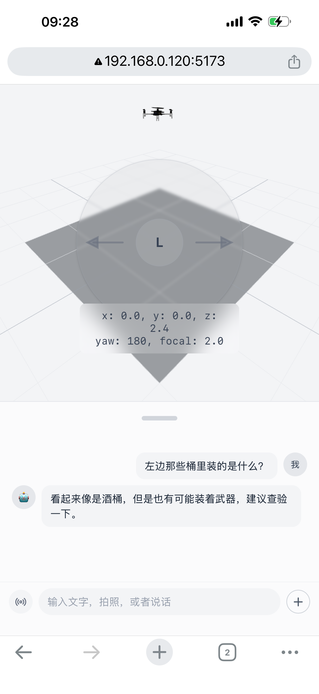
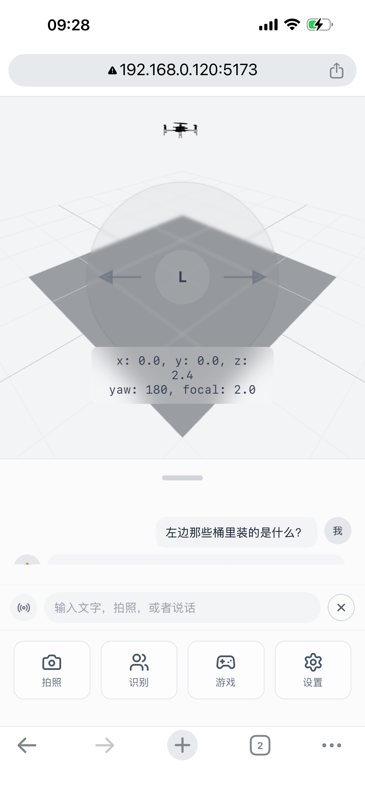
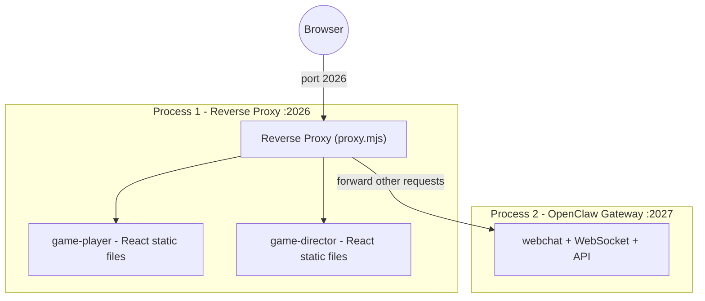
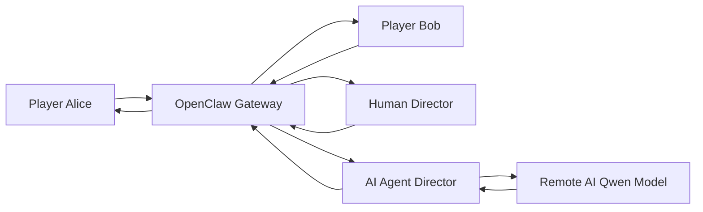

# openclaw-for-game

A mobile-first Progressive Web App that combines a 3D control interface with real-time Matrix chat. Provides touch joystick controls, a resizable chat panel powered by a live Matrix homeserver, a telemetry HUD, and an extensible toolbox.

The included demo uses a Crazyflie drone model to illustrate the control capabilities. In production, the 3D viewport is replaced with your own VR/AR scene.

<p align="center">
  
  
  
  
</p>

<p align="center">
  
  
</p>

## Features

- **Pluggable 3D Viewport** — Swap in any Three.js scene, AR camera feed, or VR environment
- **4-Mode Joystick** — Touch-based joystick with Move, Rotate, Height, and Lens (focal length) modes
- **Telemetry HUD** — Live overlay displaying position, orientation, and camera parameters
- **Matrix Chat Panel** — Resizable chat panel backed by a real Matrix homeserver; send and receive messages in real time
- **Extensible Toolbox** — Grid of quick-action buttons, customizable per game
- **PWA Support** — Installable as a native-like app on mobile devices
- **iOS Optimized** — Full safe-area support for iPhone notch and browser toolbar

## How to Use

### Joystick Control

The joystick is a semi-transparent circular overlay in the center of the viewport. It generates velocity commands that your game logic can map to any controllable entity (drone, robot, character, camera, etc.).

| Mode | Label | Action | Directions |
|------|-------|--------|------------|
| **Move** | M | Horizontal translation | Up / Down / Left / Right |
| **Rotate** | R | Yaw rotation | Clockwise / Counter-clockwise |
| **Height** | H | Vertical translation | Up / Down |
| **Lens** | L | Camera focal length (zoom) | Left (zoom out) / Right (zoom in) |

- **Toggle mode**: Tap the inner circle to cycle through modes: M → R → H → L → M
- **Control**: Touch the outer ring area and drag in the desired direction
- **Stop**: Release your finger to stop immediately

### Chat Panel

- **Swipe up** on the drag handle (gray pill at top of panel) to expand the chat area
- **Swipe down** to collapse it
- The panel snaps to three heights: collapsed (15vh), default (30vh), expanded (50vh)
- **Send** button posts a message to the selected Matrix room
- Messages appear in a scrollable list with sender names and timestamps
- Tap the **+** (plus circle) button to open the toolbox with quick-action buttons (Camera, Identify, Game, Settings)

### Telemetry HUD

The heads-up display at the bottom of the viewport shows real-time state of the controlled entity:
- Position: `x`, `y`, `z`
- Orientation: `yaw` (degrees)
- Camera: `focal` length value

The HUD fields are customizable — adapt them to display any telemetry relevant to your game (speed, health, battery, signal strength, etc.).

## Architecture

| Package | Description | Production URL |
|---------|-------------|----------------|
| `game-infra/synapse/` | Matrix homeserver (Synapse, Docker) | `http://localhost:8008` |
| `game-infra/conduit/` | Matrix homeserver (Conduit, alternative) | `http://localhost:8008` |
| `game-openclaw/` | OpenClaw gateway + AI Director agent | `http://localhost:2026/webchat` |
| `game-player/` | Player web UI (React PWA) | `http://localhost:2026/game-player/` |
| `game-director/` | Director web UI (React PWA) | `http://localhost:2026/game-director/` |

### Production Architecture Diagram



> These URLs are for **production mode** only. In standalone mode, each package runs on its own dev server port.

## Production Mode vs. Standalone Mode

Each package can run independently in **standalone mode** for development and testing — no other packages required. **Production mode** integrates all four packages into a single unified system: an FPV game engine powered by an OpenClaw AI agent.

| | Standalone Mode | Production Mode |
|--|-----------------|-----------------|
| **Purpose** | Develop and test a single package | Run the complete integrated system |
| **game-player** | `pnpm dev` on port 5173 | Served from `/game-player/` on port 2026 → `http://localhost:2026/game-player/` |
| **game-director** | `pnpm dev` on port 5174 | Served from `/game-director/` on port 2026 → `http://localhost:2026/game-director/` |
| **game-openclaw** | `./start.sh` — gateway on port 2027 | `./start-prod.sh` — gateway on port 2027 + proxy on port 2026 |
| **game-infra** | Optional — chat features need a homeserver | Required — Synapse or Conduit must be running |
| **How it works** | Each app runs its own dev server | A reverse proxy (`proxy.mjs`) on port 2026 serves built static files for game-player and game-director, and forwards all other requests (including WebSocket) to the OpenClaw gateway |

In production mode, the reverse proxy on port 2026 provides a single entry point:
- `/game-player/` → built game-player static files
- `/game-director/` → built game-director static files
- Everything else (including `/webchat` and WebSocket) → OpenClaw gateway on port 2027

### Dataflow Diagram



## Prerequisites

- Node.js 22+
- pnpm (`npm install -g pnpm`)
- Docker & Docker Compose

## Installation

### Standalone Mode

```sh
pnpm install
```

This installs dependencies for all packages (game-player, game-director, game-openclaw) via a pnpm workspace. Shared dependencies are deduplicated automatically.

**Access URLs:**
| URL | Description |
|-----|-------------|
| `http://localhost:5173` | Game Player dev server |
| `http://localhost:5174` | Game Director dev server |
| `http://localhost:2027/webchat` | OpenClaw gateway |

### Production Mode

```sh
pnpm install
```

Build the web apps:
```sh
pnpm build:player:prod
pnpm build:director:prod
```

Setup game-openclaw:
```sh
cd game-openclaw
./install.sh
cd ..
```

You will need:
- A **Qwen API key** from https://dashscope.console.aliyun.com/apiKey
- A **Matrix access token** for `@ai_director` — obtain with:
  ```sh
  curl -s -X POST http://localhost:8008/_matrix/client/r0/login \
    -H "Content-Type: application/json" \
    -d '{"type":"m.login.password","user":"ai_director","password":"ai_director_pass"}' | jq -r .access_token
  ```

Or provide non-interactively:
```sh
cd game-openclaw && QWEN_API_KEY=sk-xxx MATRIX_ACCESS_TOKEN=syt_xxx ./install.sh && cd ..
```

**Access URLs:**
| URL | Description |
|-----|-------------|
| `http://localhost:2026/game-player/` | Game Player web UI |
| `http://localhost:2026/game-director/` | Game Director web UI |
| `http://localhost:2026/webchat` | OpenClaw webchat |

## Integrated Test

### Step 1: Cleanup before start

Before running the integrated test, make sure no standalone dev servers or gateways are running, and stop any running Matrix homeservers:

```sh
# Kill any running dev servers
pkill -f "vite" 2>/dev/null

# Stop any running gateway
cd game-openclaw && ./stop.sh 2>/dev/null; ./stop-prod.sh 2>/dev/null; cd ..

# Stop any running homeserver (Synapse)
cd game-infra/synapse && docker compose down 2>/dev/null; cd ../..

# Stop any running homeserver (Conduit)
cd game-infra/conduit && docker compose down 2>/dev/null; cd ../..
```

### Step 2: Start the Homeserver

Choose Synapse or Conduit (not both — they share port 8008):

**Synapse:**
```sh
cd game-infra/synapse
docker compose up -d
cd ../..
```

**Conduit:**
```sh
cd game-infra/conduit
docker compose up -d
cd ../..
```

Verify:
```sh
curl -s http://localhost:8008/_matrix/client/versions
```

### Step 3: Register Users

**Synapse:**
```sh
docker exec game-player-synapse register_new_matrix_user -c /data/homeserver.yaml --no-admin -u alice -p 'alice_pass' http://localhost:8008
docker exec game-player-synapse register_new_matrix_user -c /data/homeserver.yaml --no-admin -u bob -p 'bob_pass' http://localhost:8008
docker exec game-player-synapse register_new_matrix_user -c /data/homeserver.yaml --no-admin -u ai_director -p 'ai_director_pass' http://localhost:8008
docker exec game-player-synapse register_new_matrix_user -c /data/homeserver.yaml --no-admin -u human_director -p 'human_director_pass' http://localhost:8008
```

**Conduit:**
```sh
cd game-infra/conduit
./register-user.sh alice alice_pass
./register-user.sh bob bob_pass
./register-user.sh ai_director ai_director_pass
./register-user.sh human_director human_director_pass
cd ../..
```

### Step 4: Start game-openclaw

**Production mode** (gateway + web UIs, port 2026):
```sh
cd game-openclaw && ./start-prod.sh &
cd ..
```

### Step 5: Test game-player

**Production mode:**
Open http://localhost:2026/game-player/, sign in as `alice` / `alice_pass`.

Open a second browser (incognito), sign in as `bob` / `bob_pass`. Both join the `#alice-bob` room automatically.

### Step 6: Test game-director

**Production mode:**
Open http://localhost:2026/game-director/, sign in as `human_director` / `human_director_pass`.

### Step 7: Verify the AI Director

1. All 4 users (alice, bob, ai_director, human_director) should be in the `#alice-bob:matrix.openclaw.local` room.
2. Type a message as alice, bob, or human_director.
3. The `ai_director` agent should reply with a short joke related to the message.

### Step 8: Cleanup after completed

```sh
# Stop game-openclaw
cd game-openclaw && ./stop-prod.sh && cd ..

# Stop the homeserver
cd game-infra/synapse && docker compose down && cd ../..
```

## User Accounts

| User | Matrix ID | Password | Role |
|------|-----------|----------|------|
| Alice | `@alice:matrix.openclaw.local` | `alice_pass` | Player |
| Bob | `@bob:matrix.openclaw.local` | `bob_pass` | Player |
| AI Director | `@ai_director:matrix.openclaw.local` | `ai_director_pass` | AI Agent Director |
| Human Director | `@human_director:matrix.openclaw.local` | `human_director_pass` | Human Director |
| Admin | `@admin:matrix.openclaw.local` | `admin_pass` | Server Admin |

## Package Details

- **game-infra/synapse/** — [README](game-infra/synapse/README.md)
- **game-infra/conduit/** — [README](game-infra/conduit/README.md)
- **game-openclaw/** — [README](game-openclaw/README.md)
- **game-player/** — [README](game-player/README.md)
- **game-director/** — [README](game-director/README.md)

